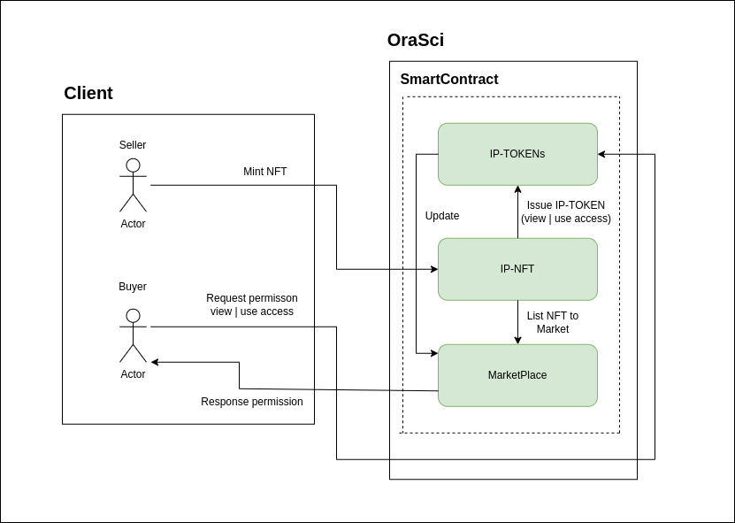

# Introduction
The OraSci ecosystem is a decentralized network of science solution providers, built on the BOS and Near protocols, offering an innovative platform for decentralized scientific advancements.

## Flow Architecture


## Mint NFT
Run by these step:
```bash
git clone this source
```
```bash
cd /this_source/ip-nft/
```
```bash
export NFT_CONTRACT_ID=test_ora_1.testnet
./build.sh
```
```bash
near login
```
```bash
near deploy --wasmFile ../out/main.wasm --accountId $NFT_CONTRACT_ID
```
```bash
near call $NFT_CONTRACT_ID new_default_meta '{"owner_id": "'$NFT_CONTRACT_ID'"}' --accountId $NFT_CONTRACT_ID
```
```bash
near call $NFT_CONTRACT_ID nft_mint '{"token_id": "token-1", "metadata": {"title": "My Non Fungible Team Token", "description": "The Team Most Certainly Goes :)", "media": "https://bafybeiftczwrtyr3k7a2k4vutd3amkwsmaqyhrdzlhvpt33dyjivufqusq.ipfs.dweb.link/goteam-gif.gif"}, "receiver_id": "'$NFT_CONTRACT_ID'"}' --accountId $NFT_CONTRACT_ID --amount 0.1
```
## Issue IP-TOKENS
```bash
export FT_CONTRACT_ID
export TEST_IP_TOKEN_ID
```
```bash
export FT_CONTRACT_ID=token-dungho.testnet
```
```bash
export FT_CONTRACT_ID=token-dungho.testnet
```
```bash
near deploy --accountId $TEST_IP_TOKEN_ID --wasmFile out/ip_token.wasm --initFunction new --initArgs '{"owner_id": "'$TEST_IP_TOKEN_ID'", "metadata": {"spec":"ip-token-1.0.0","name":"IP Token","symbol":"IP","ip_nft_id":"1","original_owner":"bakansm.testnet"}}’
```
```bash
near call $TEST_IP_TOKEN_ID issue_ip_token '{"receiver":"'$DUNG_USER_1'","access_type":"ReadAccess"}' --accountId $DUNG_USER_1
```
```bash
near view $TEST_IP_TOKEN_ID get_token_access '{"token":1}'
```
```bash
near call $NFT_CONTRACT_ID nft_approve '{"token_id": "2", "account_id":"'$MARKETPLACE_CONTRACT_ID'","msg":"{\"sale_conditions\":\"100000000\"}" }' --accountId $KHANH --depositYocto 730000000000000000000
```

## List Marketplace
```bash
export MARKETPLACE_CONTRACT_ID=market_ora_1.testnet
```
```bash
cd ip-marketplace / build.sh
```
```bash
near deploy --wasmFile ../out/market.wasm --accountId $MARKETPLACE_CONTRACT_ID
```
```bash
near call $MARKETPLACE_CONTRACT_ID new '{"owner_id": "'$MARKETPLACE_CONTRACT_ID'"}' --accountId $MARKETPLACE_CONTRACT_ID
```
Add deposit storage:
```bash
near call $MARKETPLACE_CONTRACT_ID storage_deposit '{"account_id": "'$NFT_CONTRACT_ID'"}' --accountId $NFT_CONTRACT_ID --depositYocto 10000000000000000000000
```
List nft to market:
```bash
near call $NFT_CONTRACT_ID nft_approve '{"token_id": "token-1", "account_id":"'$MARKETPLACE_CONTRACT_ID'","msg":"{\"sale_conditions\":\"100000000\"}" }' --accountId $NFT_CONTRACT_ID --depositYocto 1
```


